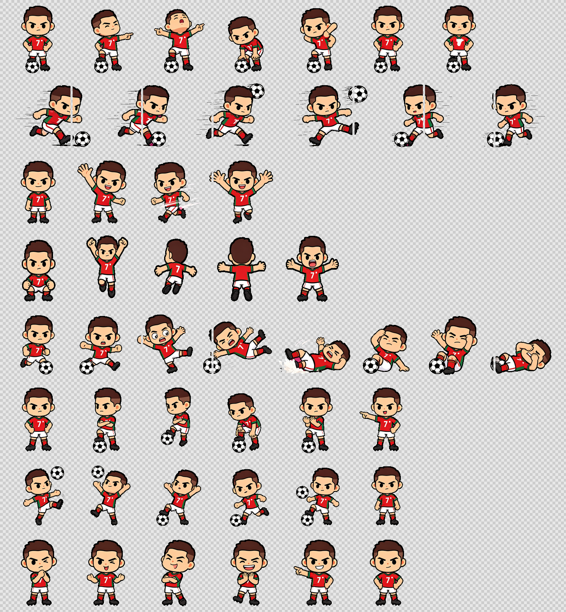
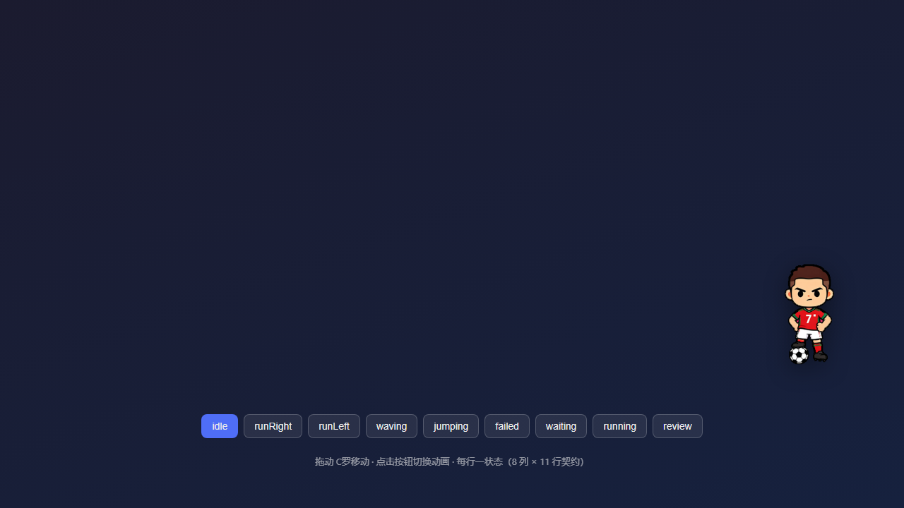
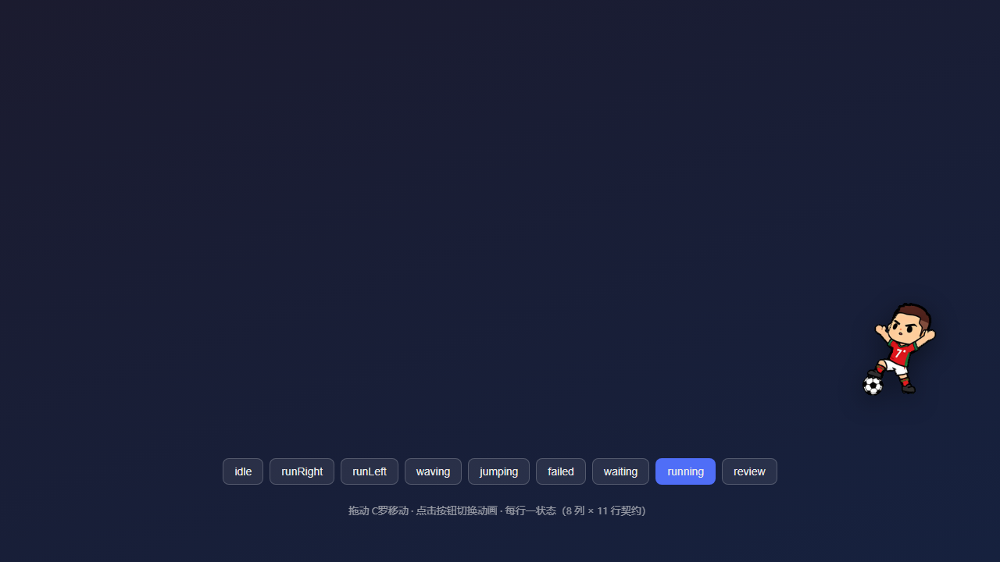
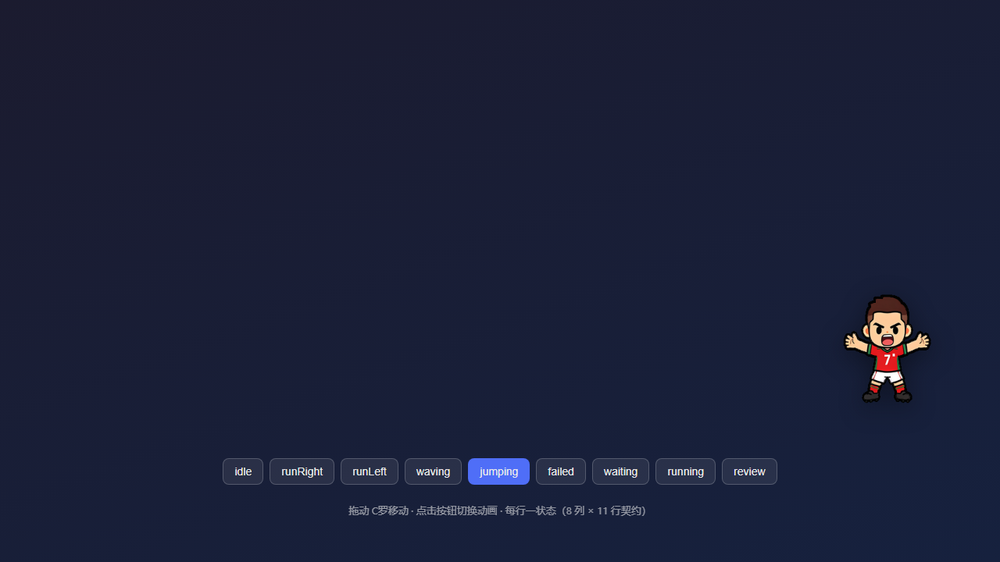

# 🐾 DSH 桌宠（dsh-ronaldo-pet）· v2

> **DeepSeek Harness（DSH）桌面宠物插件** —— 一只住在界面里、**同时也住在你电脑桌面上**的小家伙。
> 它盯着 Agent 干活：对话进行中专注工作、回合中思考、等待审批时期待地看你、出错时戏剧性摔倒；
> **对话完成时跳起来庆祝并全机播放提示音**。
>
> v2 的三个核心变化：
> 1. **原生桌面窗口** —— 最小化甚至关掉浏览器它都还在，只要终端还在运行就一直存在。
> 2. **一句话生成新宠物** —— 配套技能 [`dsh-pet-forge`](skill/dsh-pet-forge/SKILL.md)：生图模型 + Blender 3D 建模 + 动作/音效设计，全程自动。
> 3. **分辨率不限** —— 单格画多大都行（像素风、精细立绘、写实素材），显示时等比缩放。
>    多宠物注册表跨重启保留，每只独立音频、大小、行为、位置。



> 上图是内置 C罗 的动作总表：待机 / 奔跑 / 挥手 / 庆祝跳 / 摔倒 / 等待 / 专注工作 / 思考。
> 用 `node skill/dsh-pet-forge/scripts/inspect.mjs assets/spritesheet.png --out out.png` 可以自己生成。

### 截图

| 待机 | 颠球（奔跑） | SIU 庆祝 |
| --- | --- | --- |
|  |  |  |

> 这三张来自 [`demo/index.html`](demo/index.html)（纯静态的动画预览页，双击就能打开）。
> 清单见 [`screenshots.json`](screenshots.json)，插件市场抓取上架素材时会用到。

---

## ✨ 特性

### 渲染与交互

- **完整精灵动画**：8 列 × 11 行图集契约，含 idle / 奔跑 / 挥手 / 跳跃 / 摔倒 / 等待 / 专注 / 思考 / 16 方向视线
- **分辨率不限**：单格多大都行 —— 192px 像素风、1024px 精细立绘、乃至写实素材，显示时等比缩放。
  内置 C罗 是 192×208；作者按 2× 创作（显示宽度 = 单格宽 ÷ 2），写实素材不会一上来被缩成小图。
  `scaling: smooth / pixelated` 决定缩小走平滑重采样还是最近邻（像素风不被糊掉）
- **实时感知 Agent 状态**：Host 轮询 `agents` 服务，并监听 `tools/execute`、`approval/request`、`agent/request-error`，推导 工作 / 思考 / 等待 / 出错 / 空闲 / 完成 六种模式
- **可互动**：拖动、悬停看光标、快速连点三次摔倒、单击冒气泡
- **多宠物并排**：右下角一行站开，拖动后各自独立定位

### 🖥 原生桌面窗口（v2 新增）

无边框、背景透明、永远置顶的 WPF 窗口，**不依赖浏览器**：

| 操作 | 行为 |
| --- | --- |
| 悬停 | 显示**当前工作区 + 当前对话标题** + Agent 状态 |
| **双击** | 用 **Microsoft Edge** 打开 Harness 网页 |
| 单击 | 冒台词气泡 + 点击音效 |
| 快速点三下 | 摔跤动画 + 音效 |
| 拖动 / 滚轮 | 移动（位置跨重启保留）/ 改大小（32～1024 DIP） |
| 右键 | 菜单：打开网页 / 切换宠物 / **平时行为（10 种）** / **大小（含"自动"）** / **系统音开关** / 置顶 / 复位 / **隐藏** / **设为默认** / 退出 |

> 右键菜单里的这些改动会**写回宿主**，和网页设置面板是同一份状态 —— 在桌面上改完，
> 网页里也是改过的样子。大小默认「自动」：跟随素材原生分辨率（单格宽 ÷ 2）。

- **终端一起来就出现**：插件随 profile 加载时自动拉起（`desktopPet: true` 可关）
- **终端一停就消失**：桌宠自己轮询宿主，宿主进程没了或 15 秒无响应就退出
- **透明处不挡鼠标**：按光标下方像素的 alpha 动态切换 `WS_EX_TRANSPARENT`。
  命中检测只取**当前那一格**的像素，高分辨率图集不会因此吃掉大量内存
- 详见 [`desktop/README.md`](desktop/README.md)

### 🎨 一句话生成宠物（配套技能）

`dsh-pet-forge` 技能把「做一只桌宠」压成一句话：

```powershell
# 1. 环境自检（生图模型 / Blender / 插件 / TTS 一次看清）
node "$env:USERPROFILE\.agents\skills\dsh-pet-forge\scripts\forge.mjs" doctor

# 2. 生成（会先问你画风/动作/音效，都有推荐）
node ...\forge.mjs generate --pkg "D:\代码\桌宠\pets\cyber-cat" --brief "赛博朋克风格的机械猫" `
  --tier A --actions idle,running,review,waiting,jumping,failed `
  --audio "sfx:celebrate,sfx:failed,sfx:click"

# 3. 校验 + 目视检查 + 注册（注册后界面右下角立刻出现，无需刷新）
node ...\forge.mjs verify --pkg <目录>
node ...\forge.mjs inspect --pkg <目录>
node ...\forge.mjs install --pkg <目录>
```

三条路线：

| 路线 | 成本 | 适用 |
| --- | --- | --- |
| **A · 2D 单图程序化** | 1 次生图 | 默认。最稳、可复现 |
| **B · 2D 多帧生图** | 每动作再 1 次生图 | 姿态更自然 |
| **C · 3D Blender** | 1 次生图（取色）+ Blender 渲染 | 要真 3D、能转视角、要 GLB |

### 🗂 统一管理

**默认只开一只。** 同一时间只显示 ⭐「默认打开的桌宠」，其它自动收起——
不会因为生成了几只就站一排。想同时养多只，点各自的「👁 显示中」即可
（手动打开过的会被记住，之后切换默认不会再被自动收起）。开箱即用是 **C罗**。

设置 → **⚽ 桌宠**：

- **🐾 宠物**：**⭐ 设为默认**、改名、大小、平时行为、系统音开关、显示/隐藏、复位、移除；
  全部跨重启保留。工具栏有「全部打开」「只开默认」两个一键操作
- **🖥 桌面窗口**：启停 / 重启 / 自启开关 / 日志路径
- **✨ 生成新宠物**：技能用法说明 + 手动导入 spritesheet（带尺寸校验）

**新生成/新注册的宠物会自动接管默认位**（这样生成完立刻就能看到它），其它宠物自动收起。
只想注册不上场：`forge install --pkg <目录> --no-focus`，然后在设置里手动打开或设为默认。

默认窗口读的是宿主的 `settings.defaultPet`，所以网页里点了 ⭐ 之后，
**桌面上的原生窗口也会跟着切换**（它每 4 秒拉一次宠物列表）。

老版本升级上来时，注册表里没有 `defaultPet` 字段，首次加载会自动收敛成"只留一只"
（内置 C罗，没有就取第一只），避免升级后右下角突然站一排。

---

## 🚀 安装

```bash
# 从 GitHub 安装
dsh plugin --profile web add github:Stellum-Waq/dsh-pet-ronaldo

# 本地开发（改代码即时生效，profile 里是软链接）
dsh plugin --profile web add D:\代码\桌宠\dsh-ronaldo-pet
```

然后**重启 `dsh web`**。插件随 profile 常驻加载，界面右下角出现宠物，**桌面右下角出现原生窗口**。

安装配套技能：

```powershell
Copy-Item -Recurse -Force .\skill\dsh-pet-forge "$env:USERPROFILE\.agents\skills\"
```

卸载：

```bash
dsh plugin --profile web remove dsh-ronaldo-pet
```

---

## ⚙️ 配置

所有可调项集中在 `host.js` 顶部 `CONFIG`，也可以通过 bundle patch 行传入：

| 配置 | 默认值 | 说明 |
| --- | --- | --- |
| `spritePath` / `voicePath` | `<包目录>/assets/…` | 内置 C罗 的素材 |
| `pollMs` | `500` | Agent 状态轮询间隔 |
| `celebrateMs` / `failedMs` | `4800` / `2600` | 庆祝 / 失败动画时长 |
| `registryPath` | `$DSH_HOME/storages/dsh-pet-forge/registry.json` | 多宠物注册表 |
| `desktopPet` | `true` | 是否随插件启动原生桌面窗口 |
| `desktopScript` / `desktopLog` | `<包目录>/desktop/DesktopPet.ps1` · `$DSH_HOME/storages/dsh-pet-forge/desktop-pet.log` | 桌面窗口脚本与日志 |

例：给插件行加 `config: { desktopPet: false, pollMs: 800 }`。

---

## 🔌 HTTP 接口（技能与调试用）

全部挂在 `/ronaldo-pet/*`：

| 方法 | 路径 | 说明 |
| --- | --- | --- |
| GET | `/state` | 当前模式、注册表版本、**当前工作区/对话**、桌面窗口状态 |
| GET | `/pets` | 宠物列表（含图集 URL、状态表、音效 URL） |
| GET | `/asset/<id>/<相对路径>` | 素材直出（PNG/WebP/WAV/MP3/GLB） |
| POST | `/pets/register` | 注册宠物包 `{dir}` —— **注册即校验**，不合格返回 422 |
| POST | `/pets/unregister` | 卸载 `{id}`（只取消注册，不删文件） |
| POST | `/pets/update` | 改 `{id, patch:{name,size,visible,behavior,sound,pos}}` |
| POST | `/settings` | 宿主提示音策略 `{patch:{audioMode,systemSound}}` |
| POST | `/play` | 让宿主进程试播音效 `{id,key}` |
| POST | `/desktop` | 原生窗口控制 `{action:status\|start\|stop\|enable}` |

---

## 📁 项目结构

```
dsh-ronaldo-pet/
├── host.js                    # bundle 插件 Node/Host 半：状态机 + 注册表 + 资源路由 + 桌面窗口管理
├── client/client.js           # bundle 插件浏览器/Client 半：shell.overlay + settings.section
├── cordis.patch.yml           # bundle patch（插入插件行）
├── package.json               # bundle 插件元数据
├── assets/
│   ├── spritesheet.webp/.png  # 内置 C罗 图集（WebP 给网页 / PNG 给 WPF）
│   └── siu.mp3
├── desktop/                   # 🖥 原生桌面窗口
│   ├── DesktopPet.ps1         #   WPF 窗口（纯 ASCII，中文走 strings.zh.json）
│   ├── strings.zh.json        #   全部界面文案
│   ├── Start.cmd / Stop.cmd
│   └── README.md
├── skill/dsh-pet-forge/       # 🎨 配套技能（一句话生成宠物）
│   ├── SKILL.md
│   ├── references/            #   actions / audio / prompts / troubleshooting / pet-package
│   └── scripts/
│       ├── forge.mjs          #   主 CLI（doctor/plan/generate/build/audio/blender-*/verify/…）
│       ├── selftest.mjs       #   离线自检（不联网也能跑）
│       ├── inspect.mjs        #   图集目视检查图
│       └── lib/               #   png / imaging / anim / audio / manifest / imagegen / blender / install / preview
├── scripts/
│   ├── smoke-host.mjs         # Host 路由集成冒烟测试（30 项断言）
│   ├── verify-desktop.mjs     # 桌面窗口"真的显示出来了吗"验证器
│   ├── dev-server.mjs         # 独立端口的本地调试服务器
│   └── build-assets.mjs       # 从 WebP 生成桌面端 PNG
├── docs/SPRITESHEET-CONTRACT.md
└── demo/index.html
```

自检：

```powershell
node scripts\smoke-host.mjs                        # Host 路由
node scripts\verify-desktop.mjs --base http://127.0.0.1:3080   # 桌面窗口真的显示了吗
node skill\dsh-pet-forge\scripts\selftest.mjs     # 图像/动画/音频内核
```

---

## 🧩 精灵图契约（8 列 × 11 行）

网格固定，**单格分辨率不限**：画多大都行，显示时等比缩放。要求只有一条 ——
图集实际尺寸必须严格等于 `列数×单格宽` × `行数×单格高`（这条闸保证取帧不错位）。

| 行 | 状态 | 用途 |
| ---: | --- | --- |
| 0 | idle | 待机呼吸 |
| 1 / 2 | runRight / runLeft | 拖动时奔跑 |
| 3 | waving | 挥手 |
| 4 | jumping | **对话完成** |
| 5 | failed | **出错 / 连点三次** |
| 6 | waiting | 等待审批 |
| 7 | running | 专注工作 |
| 8 | review | 思考 |
| 9 / 10 | look | 视线（2D：16 方向；3D：环视角度） |

分辨率与缩放的完整说明（2× 创作约定、`scaling` 字段、4096px / 6400 万像素上限）
见 [`docs/SPRITESHEET-CONTRACT.md`](docs/SPRITESHEET-CONTRACT.md)。

---

## ❓ 常见问题

**桌宠会出现在所有会话里吗？**
会。网页版注册进 `shell.overlay`（root 级浮动层，全应用可见）；桌面窗口是独立进程，跟浏览器无关。

**关掉浏览器桌宠还在吗？**
在。桌面窗口是独立进程，只要 `dsh` 终端还在运行就一直存在。关掉终端它会自己退出（15 秒内）。

**桌宠会挡住我点别的东西吗？**
不会。透明像素处鼠标事件会穿透到下面的窗口（按 alpha 动态切换 `WS_EX_TRANSPARENT`）。

**有动作但没声音？**
声音是**宿主进程**播的（`/ronaldo-pet/play` 可单独验证），与浏览器静音无关。检查设置里是否关了「系统音」，或该宠物的 🔊 按钮。

**状态显示"运行中"但屏幕上看不到宠物？**
跑 `node scripts\verify-desktop.mjs --base <地址>`。它会直接抓窗口内容并报告精灵有没有画出来——比肉眼看可靠。（注意：整屏截图 `CopyFromScreen` 看不到分层窗口，这是踩过的坑。）

**macOS / Linux 能跑吗？**
网页版完全能跑（`host.js` 的 `playCommand()` 已按平台选择播放器）。**原生桌面窗口目前只有 Windows（WPF）实现**，其它平台会在设置里显示"不支持"。

**为什么 `DesktopPet.ps1` 里一个中文都没有？**
PowerShell 5.1 读取无 BOM 的 `.ps1` 会按系统 ANSI 代码页解析，中文会变乱码（而工作区路径本身就叫 `D:\代码\桌宠`）。所以脚本保持纯 ASCII，文案全放 `strings.zh.json`（UTF-8 显式读取）。详见 `desktop/README.md`。

---

## ⚠️ 素材版权声明

- `assets/siu.mp3` 为网络公开的二创梗语音片段，版权归原作者所有，**仅供个人学习交流使用**。
- `assets/spritesheet.webp` 为粉丝二创像素形象，沿用 Codex 桌宠素材契约制作。
- 用 `dsh-pet-forge` 生成的宠物：图集来自生图模型，请自行确认所用模型的服务条款。
- 若您是权利人且不希望相关内容被展示，请联系删除。

## 📄 License

代码以 [MIT License](LICENSE) 开源。素材文件（`assets/`）仅限个人学习交流。
